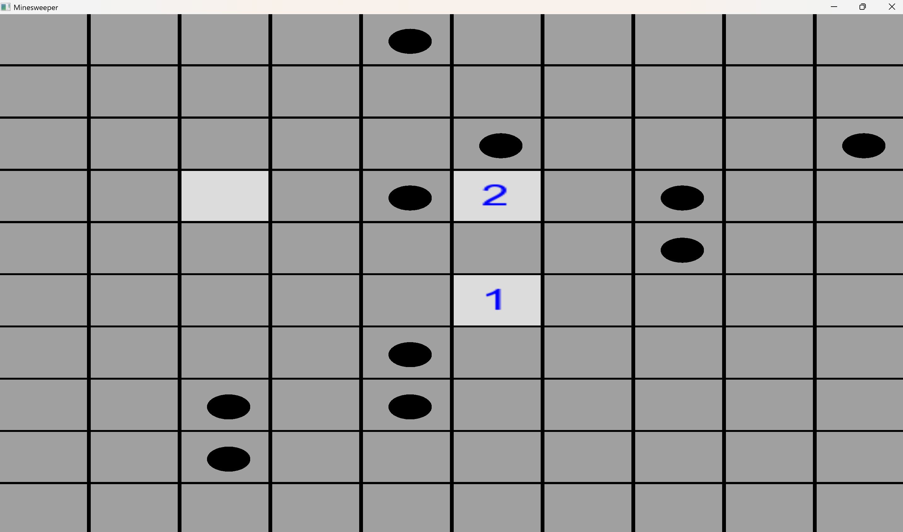

# 🧨 Minesweeper Game (C++ & SFML)

A classic **Minesweeper game** built using **C++** and **SFML (Simple and Fast Multimedia Library)**.  
This project demonstrates **core game logic, event handling, and GUI programming** in C++ and is designed to be **resume and internship ready**.

---

## 🎮 Game Overview

Minesweeper is a logic-based puzzle game where the player uncovers cells on a grid while avoiding hidden mines.  
Each revealed cell displays the number of adjacent mines, helping the player make informed decisions.

---

## ✨ Features

- 10×10 grid-based Minesweeper board  
- Random bomb placement at runtime  
- Left-click to reveal cells  
- Right-click to flag and unflag cells  
- Numbered hints for adjacent bombs  
- Game-over detection with bomb reveal  
- Simple, clean graphical interface  

---

## 🛠️ Tech Stack

- **C++ (C++17)**
- **SFML (Graphics, Window, System)**
- **MinGW / MSYS2**
- **Git & GitHub**
- **Windows**

---

## 📸 Gameplay Screenshot

> Screenshot of the working game:



---

## 📂 Project Structure

Minesweeper-SFML/
│
├── src/
│ └── main.cpp
│
├── assets/
│ └── arial.ttf
│
├── screenshots/
│ └── gameplay.png
│
├── .gitignore
├── README.md

---

## 🚀 How to Run Locally

### 1️⃣ Prerequisites
- C++ compiler (G++ / MinGW)
- SFML installed and configured

### 2️⃣ Compile
```bash
g++ src/main.cpp -o minesweeper -lsfml-graphics -lsfml-window -lsfml-system
3️⃣ Run
./minesweeper
Ensure arial.ttf is present in the assets/ folder.
🎯 Purpose of This Project

This project was created to:

Strengthen C++ fundamentals

Learn GUI development using SFML

🎯 Purpose of This Project

This project was created to:

Strengthen C++ fundamentals

Learn GUI development using SFML

📌 Future Improvements (Optional)

Recursive reveal of empty cells

Timer and restart button

Difficulty levels (Beginner / Intermediate / Expert)

Improved UI styling

👤 Author

Ruhanika